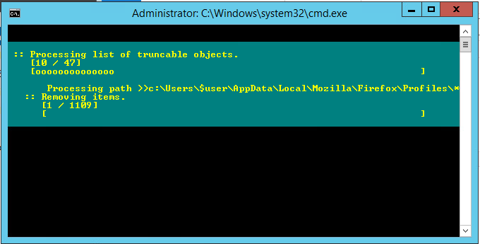
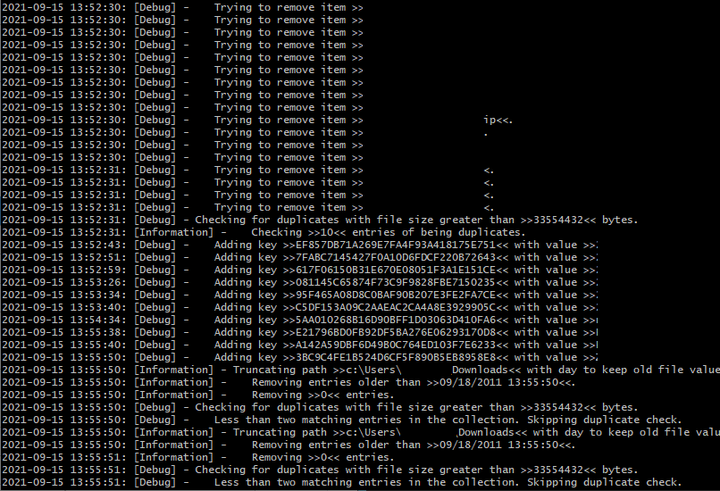

# Cleanup temporary or cached files

Free as in freedom microsoft windows terminal server cleanup script.

The current change log can be found [here](CHANGELOG.md).

This Skript is currently tested on:

* Windows Server 2012 - Version 6.2 (Build 9200)
* Windows Server 2012 R2 - Version 6.3 (Build 9600)
* Windows 10 - Version 20H2 (Build 19042.870)

## Something for the mood

## Configuration and using it

This script comes out of the box in a "ready to execute" way.
You can run the [start_clean_up_system.bat](start_clean_up_system.bat) right away as administrator and the script will clean up stuff.

If you want to configure anything, you should copy the [localConfiguration.ps1.dist](data/localConfiguration.ps1.dist) as `localConfiguration.ps1` in the [data](data) path.
You can enable verbosity or log level in the local configuration. And of course, you can add more paths for the clean up system itself.
If you want to configure anything per host basis but keep it in the same path, you can create a file like `local-<hostname>-Configuration.ps1` in the [data](data) path.

For each path, you can configure if you want to keep files older than x days. Furthermore, you can run a duplicate check, based on file hashs, and restrict to only bigger files.
This script comes with a bit of magic. If you put it `$user` in a path, the script will replace this with all available users it can find below `C:\Users\`.

The skript is shipped with a lock mechanism to prevent executing the same script in parallel.

The skript can log! In fact, if you run it with `$globalLogLevel = 0`, you get a lot of information.
The skript is silent by default. Even under windows, the unix way is the right one, be silent until I set `$beVerbose = $true`.

## General Idea

This script helps you to clean up a multi user window system, like a terminalserver, with just one click.
The script is logging what it does, depending on your log level more or less.
The script comes with a collection of paths pointing to temporary or cache files.

You should run this script when no user is using the system, like at night.

At the end, you iterate over a big list of locations and delete the content of it.

# Links

* [Clean Browser Cache and Recycle Bin](https://github.com/Bromeego/Clean-Temp-Files) - 20210406
* [How to clear your Microsoft Teams cache on Windows 10](https://www.onmsft.com/how-to/how-to-clear-your-microsoft-teams-cache-on-windows-10) - 20200428
* [How to Create and Manage Scheduled Tasks with PowerShell?](http://woshub.com/how-to-create-scheduled-task-using-powershell/) - 20210408
